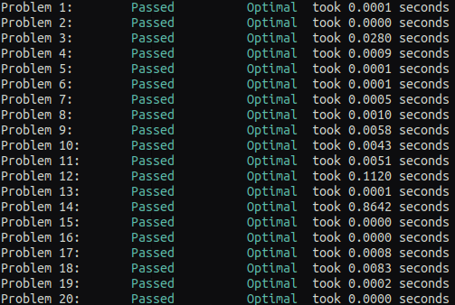

# Introduction to Coding

## Basic

To start with a short introduction to python start with the `basics.ipynb`.
You can open this Jupyter notebook by typing in the terminal.

```
jupyter notebook basics.ipynb
```

Then we can transfer to the command line to run python from the terminal. For this
take a look at `first_program.py`. Once the assignment is completed you can run your
program by typing

```
python first_program.py
```

This should provide you with enough information to use the `mda_intro.py` boilerplate. 
Here the idea is to write a function to compute the radius of gyration of 
a trajectory. Here MDAnalysis is used to read the .xtc and make selections. 
The result can then be verified by replacing your function with `your_selection.radiusOfGyration()` 
or also with the following command that requires GROMACS. Keep in mind that this
observable is usually computed only for the backbone.

```
gmx gyrate -f your.xtc -s your.tpr -n your.ndx 
```

**Note: If you do not have a trajectory available then please complete the following
tutorial http://www.mdtutorials.com/gmx/lysozyme/index.html**

## Intermediate

If you wish to continue learning you can continue to the `intermediate.ipynb`.
Then you can move to the `dynamic.py` which contains some applications to dynamic
programming that can provide an easy optimization to your algorithms. Now you can
practice your skills by solving the first **20** problems in https://projecteuler.net/archives.
There is no need for an account, use the `euler.py` to answer the questions in their
respective place. You can run the `check_solutions.py` to examine your performance as well
as some feedback if your solutions need to be optimized. A required minimum is at least 5
optimal solutions. 

<p align="center">

</p>

## Introduction Object-Oriented


## Useful applications 

### Game of Life

### Tree of Life

### Protein Sequences

### Membrane Order Parameter

### Radial Distribution Function

### Molecular Dynamics (non-bonded)

### 